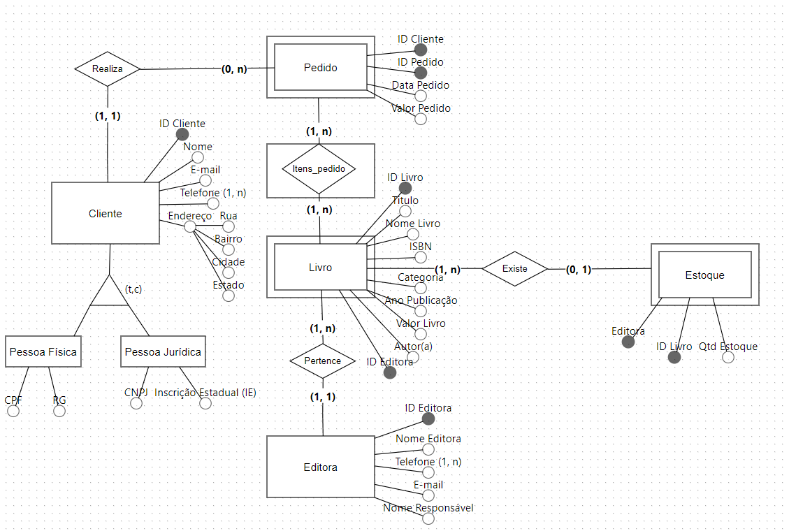
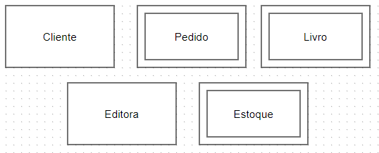
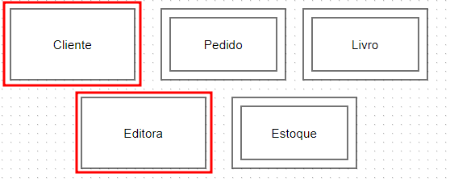
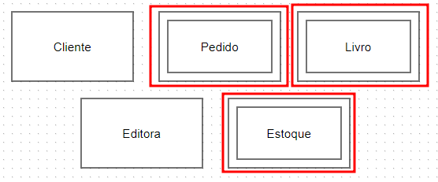
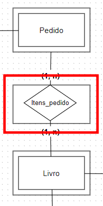
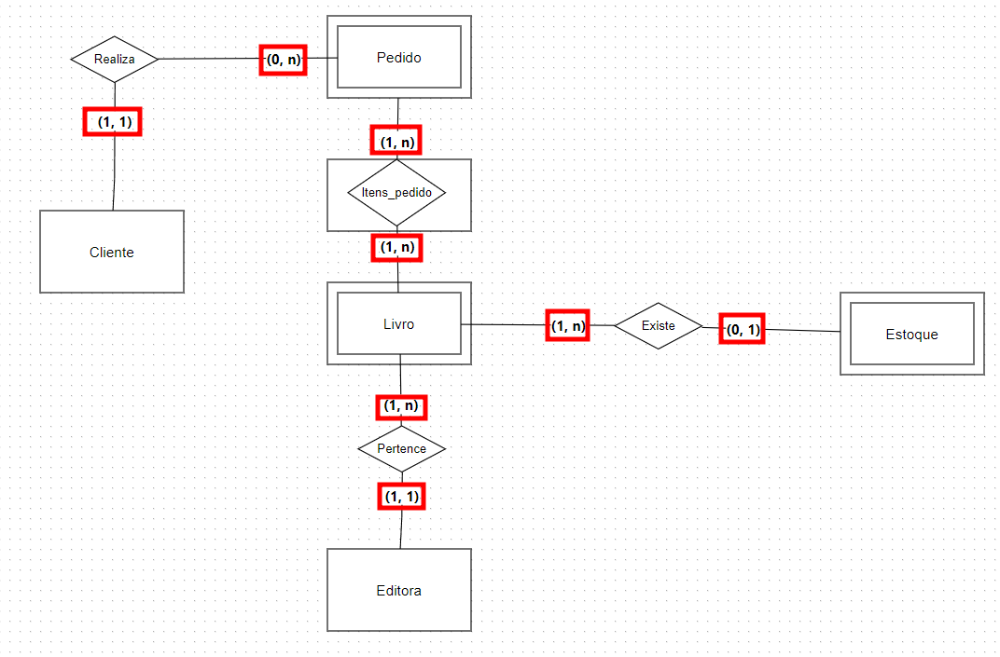
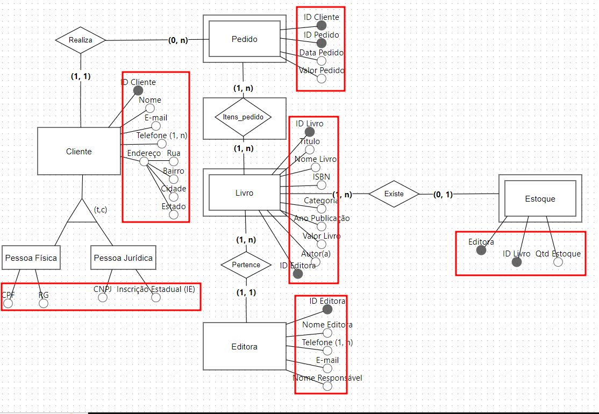

# Overview Modelo Conceitual

## MER (Modelo Entidade Relacionamento)
Utilizado para descrever os objetos do mundo real através de **entidades**, com suas propriedades que são os **atributos** e os seus **relacionamentos**.

## Entidades
Um objeto do mundo real e que possuem uma existência independente.

#### Entidades Fortes
Não dependem de outras entidades para existirem.

#### Entidades Fracas
Dependem de outras entidades para existir, ou seja, elas não possuem existência própria.

#### Entidades Associativas
Utilizadas quando existe a necessidade de associar uma **entidade a um relacionamento**. Geralmente quando temos um relacionamento **N:N**, transformamos esse relacionamento em uma entidade, pois ele representa um fato.

## Relacionamentos
As entidades podem se relacionar entre si, havendo assim uma associação.

#### (1:1) 
Entidade X se associa unicamente a uma ocorrência da entidade Y.

#### (1:N)
Entidade X se associa a várias ocorrências da entidade Y, porém, a entidade Y pode apenas se associar a uma ocorrência da entidade X.

#### (N:N)
Entidade X o pode se associar a várias ocorrências da entidade Y e a entidade Y pode também se associar a várias ocorrências da entidade X.

## Atributos
Descrevem as propriedades das entidades.

#### Atributos Simples
Atributos simples são indivisíveis, ou seja, são atributos atômicos, um exemplo seria o atributo CPF.

#### Atributos Composto
Podem ser divididos em partes menores, que representam outros atributos, como o atributo endereço (Rua, Número, Bairro, Cidade, CEP...).

#### Atributo Multivalorado
Um atributo Multivalorado pode ter um ou N(vários) valores associados a ele, como, por exemplo, o atributo telefone.

#### Atributo Derivado
Dependem de outro atributo ou até mesmo outra entidade para existir, como, por exemplo, o atributo idade e o atributo data de nascimento.

#### Atributo Chave
O atributo chave é utilizado para identificar de forma única uma entidade (ID).

#### Atributos de Especialização
São atributos que pertencem a subentidades em um relacionamento de especialização. A entidade Cliente pode ter subentidades como Pessoa Física e Pessoa Jurídica. Pessoa Física tem atributos específicos que não se aplicam à entidade Pessoa Jurídica, e vice-versa.

